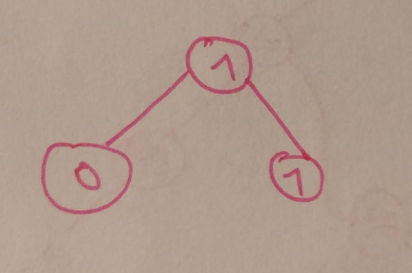
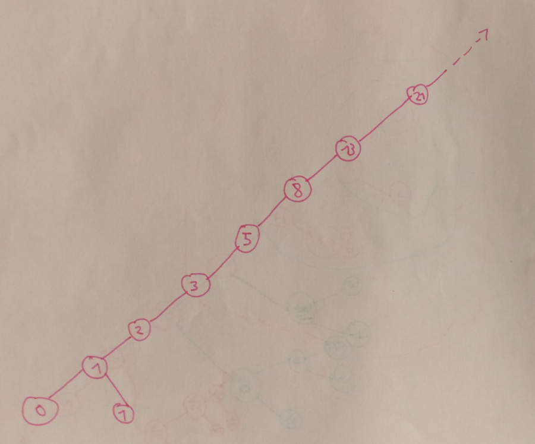
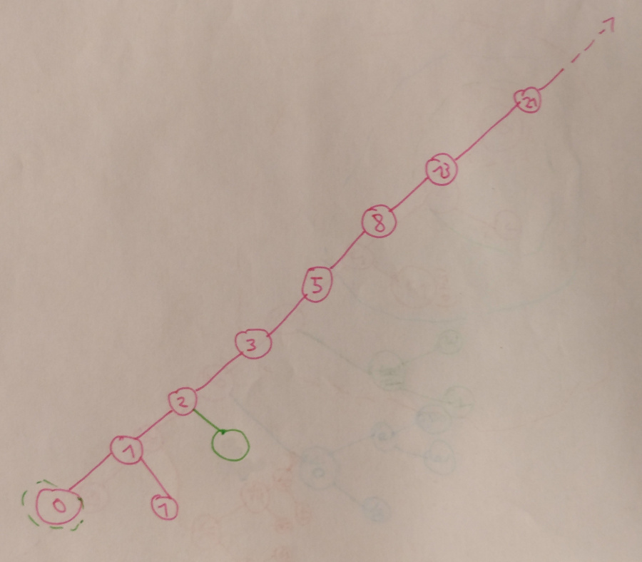
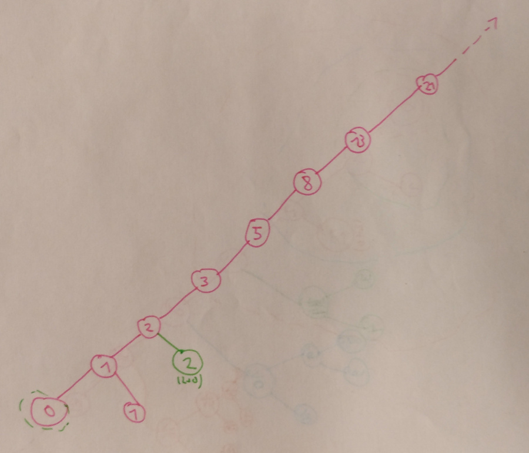
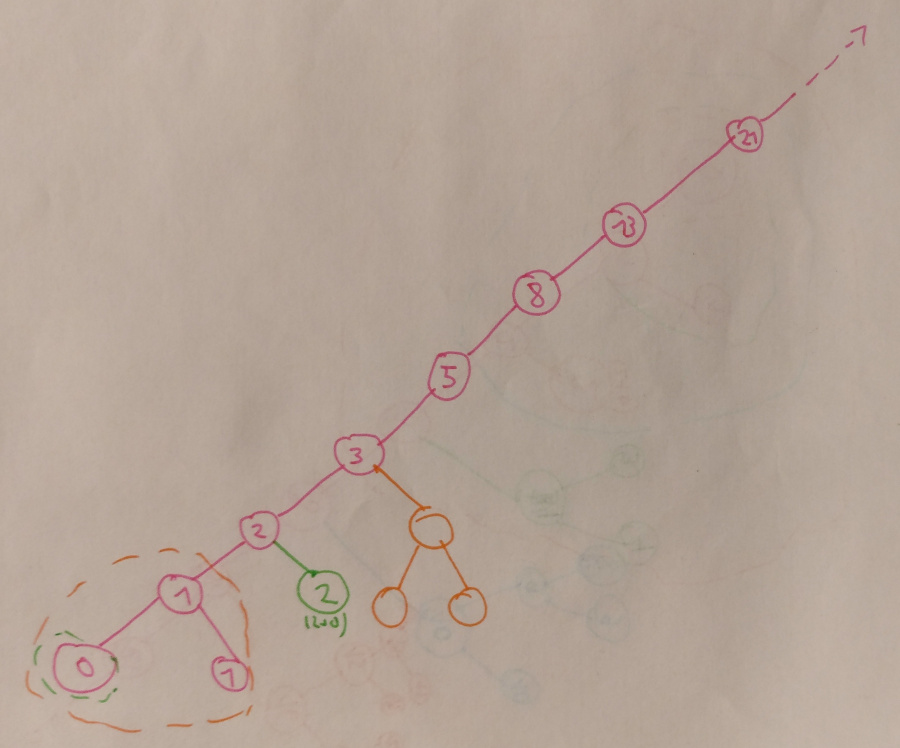
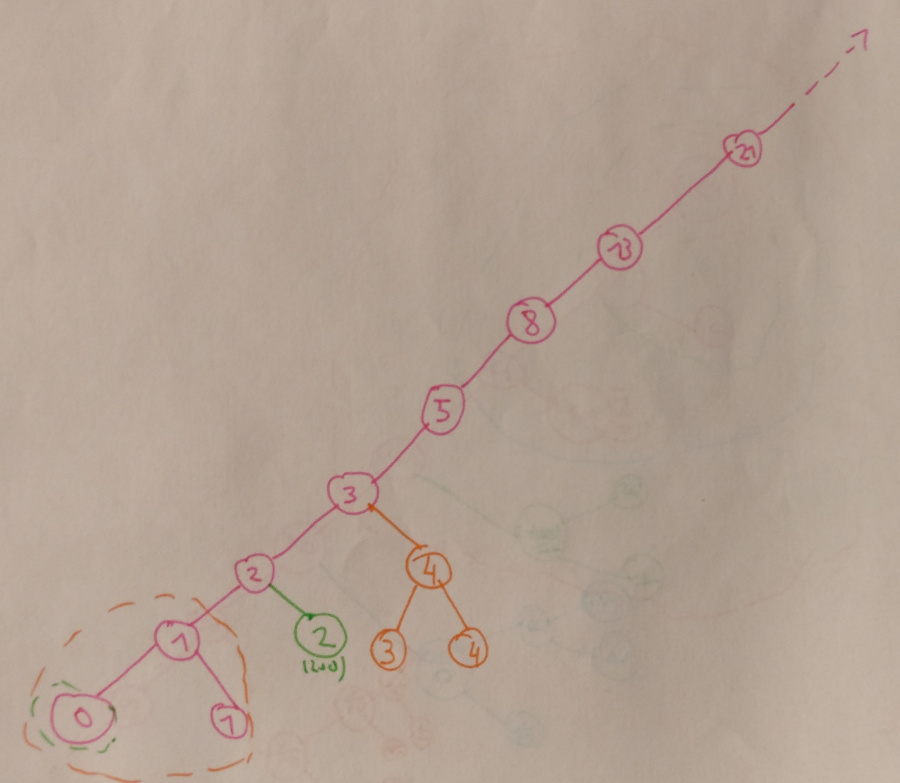
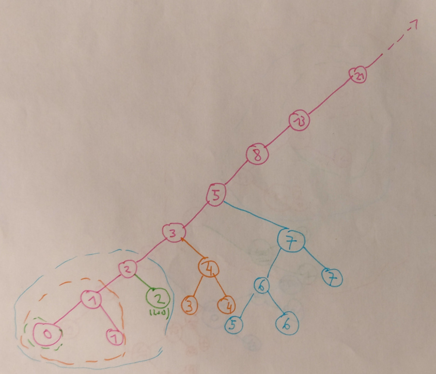
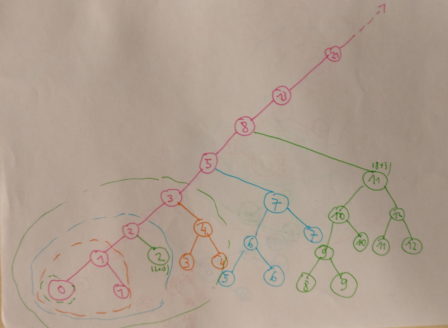
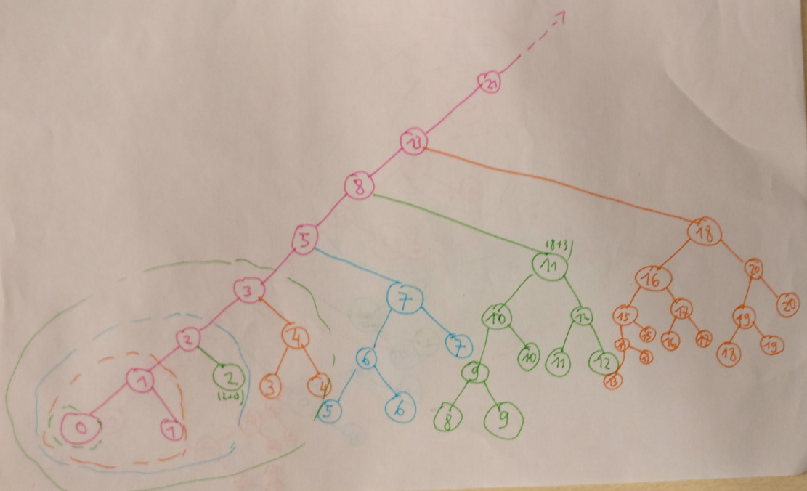

Popis konstrukce Fibonacciho stomu
==================================

První věc, co budete potřebovat, je umět vytvořit Fibonacciho posloupnost,
tj. tuhle řadu čísel:

> **0**, **1**, 1, 2, 3, 5, 8, 13, 21, ...

Pokud nevíte, jak se dělá, tak první dvě čísla jsou pevně daný a zbytek je dán
jako součet předchozích dvou čísel.

---

A teď ke konstukci toho stomu. Začneme tím, že si nakreslíme tenhle strom.
Všiměnte si, že jsou v něm použitý první 3 čísla z Fibonacciho posloupnosti:

Teď, když ho máme, tak s ním provedeme to, co je na obrázku. Nevím, jak to popsat,
prostě se protáhne jedna osa a napíšou se na ní čísla z Fibonacciho řady
*(viz začátek textu)*, s tím, že první tři čísla už jsme použili, takže teď budeme
pokračovat čtvrtým *(tj. dvojkou)*. Těch číslel si můžete napsat kolik chcete, dokud
vás bude bavit (nebo kolik jich budou chtít v zadání).

Teď už jenom zbývá nakreslit pravé syny u těch všech uzlů, co jsme si teď přidělali.
Opět začneme odspodu, tj. nejdříve uděláme pravého syna k dvojce. Až to budeme mít,
tak pak uděláme pravýho syna ke trojce, pětce, osmičce atd...

Ale nejdříve tu dvojku. Podíváme se na jejího levého syna *(tam je jednička)* a od něj
ještě jednou na levého syna *(to už bude ta nula)*. Jinými slovy, od tý dvojky se podíváme
o dva syny dolů *(vždycky levého)*. Teď vezmeme strukturu toho vnuka *(nuly)*
a obkreslíme jí jako pravého syna ke dvojce, ze které jsme vycházeli *(kdyby ta
nula měla nějaké syny, tak je obkreslíme taky; u dalších čísel bude tohle názornější)*.
Jaký čísla budeme do toho pravého stromu psát zatím neřešíme.

Teď už zbývá vyřešit jenom ty čísla v pravém stromu. Jsou stejná, jako u toho malého stomu,
který jsme obkreslovali, akorát se k nim přičte dvojka *(to číslo, ke kterému děláme pravého syna)*.

**Tohle je všechno**, dál už se to jenom opakuje. Teď je na řadě trojka -- její levý vnuk
je to oranžově vytečkované, tak to nakreslíme jako pravého syna tý trojky.

A čísla použijeme stejný, jenom k nim přičteme 3:

Pak se udělá totéž pro pětku:

Pak osmičku:

Pak třináctku:

A nakonec i dvacet-jedničku, ale tu už si představte sami.
